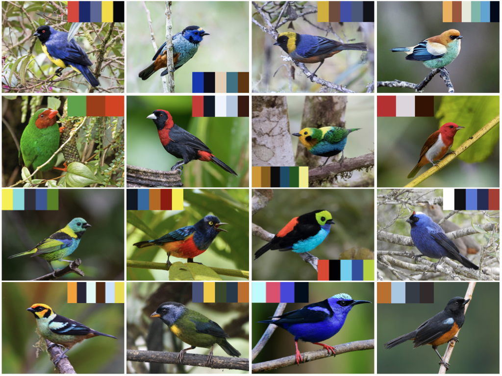

# tanagR: plumage-inspired color palettes for R

## Introduction

Sexual selection and natural selection have produced the most beautiful color palettes in the plumage of birds over millions of years of evolution - so why reinvent the (color) wheel? `tanagR` is an R package to generate color palettes for graphs inspired by the plumage of passerine birds in the tanager family (Thraupidae).

## Installation

`tanagR` is currently available only through GitHub. We hope to make it available via [CRAN](https://cran.r-project.org/web/packages/available_packages_by_name.html) soon. To install `tanagR` via GitHub, you will need `devtools`

	install.packages("devtools")
	devtools::install_github("cdanielcadena/tanagR")

## How to use tanagR

The typical pipeline for using `tanagR` involves 3 steps:

1. Visualize color palettes to choose the one that fits your needs
2. Select a color palette from the available palettes
3. Use the selected color palette to construct `base R`-style plots or `ggplot2`-style plots

## Visualize available palettes

Load `tanagR` and visualize palettes

	library(tanagR)
	names(tanagr_palettes)

Visualize one of the palettes:

	viz_palette("bangsia_edwardsi")

## Use a color palette

To use with base R

	pal = tanagr_palette("bangsia_edwardsi")
	data(iris)
	plot(iris$Sepal.Width,
		iris$Sepal.Length,
		col = pal[as.numeric(iris$Species)],
		pch = 19)

	pal = tanagr_palette("dacnis_berlepschi", n = 100, discrete = FALSE)
	image(volcano,
			col = pal,
			main = "Colors: Dacnis berlepschi")

To use with ggplot2

	library(ggplot2)
	ggplot(iris, 
		aes(x = Sepal.Length, 
		    y = Petal.Length, 
		    color = Species)) + 
	geom_point(alpha = 0.5, size  = 3) + 
	geom_density2d() + 
	theme_bw(base_size=12) + 
	scale_color_tanagr(palette_name = "stilpnia_preciosa")

	ggplot(iris, 
		aes(x = Sepal.Width, 
		    y = Sepal.Length, 
		    color = Petal.Width)) + 
	geom_point(alpha = 0.6, size  = 4) +  
	theme_bw(base_size=12) + 
	scale_color_tanagr(palette_name = "chlorochrysa_nitidissima", 
	                   discrete = FALSE)

	ggplot(mpg, 
		aes(manufacturer, 
		    fill = manufacturer)) + 
	geom_bar() + 
	theme(axis.text.x = element_text(angle = 45, hjust = 1), 
	      panel.background = element_blank()) + 
	scale_fill_tanagr(palette = "stilpnia_preciosa", 
	                  guide = "none")

## Issues

Please use the [issue tracker]() to file issues.

## Plans for the future

* More color palettes
* Color-blind friendly palettes
* Automatic generation of color palette given a bird name, extendable to species in other families

## Credits

Thanks to [Karthik Ram](https://github.com/karthik) for releasing his `wesanderson` library under MIT license.
All photographs used to generate palettes were obtained from The Macaulay Library at the Cornell Lab of Ornithology.
