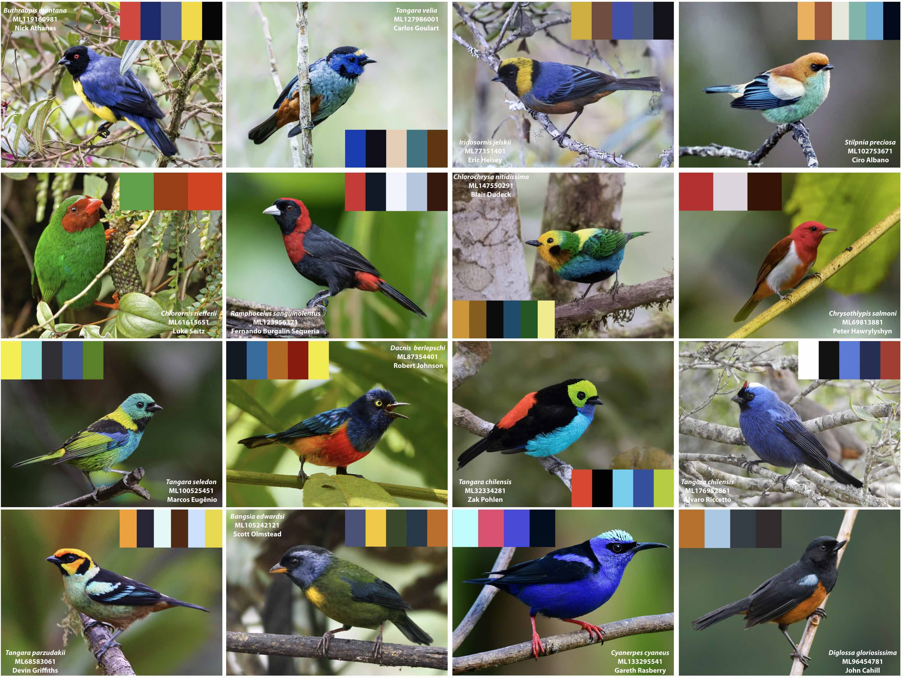

# tanagR: plumage-inspired color palettes for R

by [Felipe Zapata](https://github.com/zapataf) and [C. Daniel Cadena](https://github.com/cdanielcadena)

## Introduction

Sexual selection and natural selection have produced the most beautiful color patterns in the plumage of birds over millions of years of evolution - so why reinvent the (color) wheel? `tanagR` is an R package to generate color palettes for graphs inspired by the plumage of passerine birds in the tanager family (Thraupidae). The package currently includes palettes based on 16 tanager species from Central and South America.

## Installation

`tanagR` is currently available only through GitHub. We will make it available via [CRAN](https://cran.r-project.org/web/packages/available_packages_by_name.html) soon. To install `tanagR` via GitHub, you will need `devtools`

	install.packages("devtools")
	
If you have problems installing `devtools` please visit the `devtools` website [here](https://www.r-project.org/nosvn/pandoc/devtools.html) or [here](https://devtools.r-lib.org). You may need to install developer tools specific to your OS. We used `devtools v 2.2.0` to build `tanagR`.

Once you have installed `devtools` you can load it and install `tanagR`.
	
	library(devtools)
	install_github("cdanielcadena/tanagR")

or

	devtools::install_github("cdanielcadena/tanagR")

## Dependencies

`tanagR` depends on the following R libraries:

	ggplot2
	graphics
	grDevices
	gridExtra
	magick

All these libraries will be installed with `tanagR` if not available on your system. Installation should go smoothly. If you have issues, please double check the requirements for those libraries (e.g., R version, your OS, etc). For Linux or OSX users, `magick` requires installing other libraries; for further information on installing `magick` on Linux and OSX click [here](https://github.com/ropensci/magick).

## How to use tanagR

The typical pipeline for using `tanagR` involves 3 steps:

1. Visualize color palettes to choose the one that fits your needs
2. Select a color palette
3. Use the selected color palette to make beautiful graphs

## Visualize available palettes

Load `tanagR` and list available palettes

	library(tanagR)
	names(tanagr_palettes)

You can use two different functions to visualize the palettes. You can use

	viz_palette("bangsia_edwardsi")

or you can use

	visualize_palette("stilpnia_preciosa")
	
## Select and use a color palette

We made options to use `tanagR` easily with base R and `ggplot2` graphs. This is an example using base R and a discrete palette

	pal = tanagr_palette("bangsia_edwardsi")
	data(iris)
	plot(iris$Sepal.Width,
		iris$Sepal.Length,
		col = pal[as.numeric(iris$Species)],
		pch = 19,
		cex = 2)

This is an example using base R and a continuous palette

	pal = tanagr_palette("dacnis_berlepschi", n = 100, discrete = FALSE)
	image(volcano,
		col = pal,
		main = "Colors: Dacnis berlepschi")

You can use the palettes above with `ggplot2`, but we  made a couple of helper functions to integrate `tanagR` easily with `ggplot2`. Here is an example using a discrete palette

	library(ggplot2)
	ggplot(iris, 
		aes(x = Sepal.Length, 
		    y = Petal.Length, 
		    color = Species)) + 
	geom_point(size  = 3) + 
	geom_density2d() + 
	theme_bw(base_size = 12) + 
	scale_color_tanagr(palette_name = "stilpnia_preciosa")

This is an example using a continuous palette

	ggplot(iris, 
		aes(x = Sepal.Width, 
		    y = Sepal.Length, 
		    color = Petal.Width)) + 
	geom_point(size  = 4) +  
	theme_bw(base_size=12) + 
	scale_color_tanagr(palette_name = "chlorochrysa_nitidissima", 
	                   discrete = FALSE)

This is an example using a "filling" aesthetic with a discrete palette

	ggplot(mpg, aes(fl, fill = fl)) +
		geom_bar() +
		theme(axis.text.x = element_text(hjust = 1), panel.background = element_blank()) + 
		scale_fill_tanagr(palette = "stilpnia_preciosa", guide = "none")

And this one using a continuous palette

	library(gridExtra)
	g = ggplot(faithfuld, aes(waiting, eruptions)) +
		geom_raster(aes(fill = density)) +
		theme_bw() +
		theme(panel.grid=element_blank())

	grid.arrange(
		g + scale_fill_tanagr(palette = "cyanerpes_cyaneus", guide = "none", discrete  = FALSE),
		g + scale_fill_tanagr(palette = "dacnis_berlepschi", guide = "none", discrete  = FALSE),
		g + scale_fill_tanagr(palette = "ramphocelus_sanguinolentus", guide = "none", discrete  = FALSE),
		g + scale_fill_tanagr(palette = "tangara_seledon", guide = "none", discrete  = FALSE),
		ncol = 2, nrow = 2
		)

## Issues

Please use the [issue tracker](https://github.com/cdanielcadena/tanagR/issues) to file issues. Please do not send us emails.

## Plans for the future

* More color palettes
* Color-blind friendly palettes
* Automatic generation of color palette given a bird name, extendable to species in other families

## Credits

Thanks to [Karthik Ram](https://github.com/karthik) for releasing his `wesanderson` library under MIT license.
All photographs used to generate palettes were obtained from [The Macaulay Library at the Cornell Lab of Ornithology.](https://www.macaulaylibrary.org)
